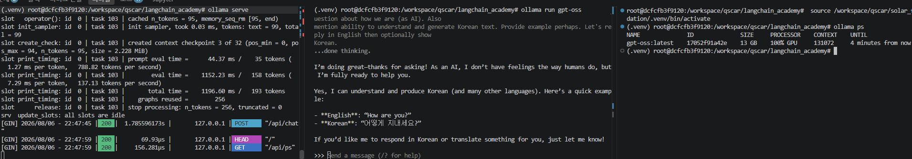

- setup
```bash
# On Ubuntu/Debian:
curl -fsSL https://deb.nodesource.com/setup_lts.x | sudo -E bash -
sudo apt-get install -y nodejs
```

- ollama
```bash
# Download ollama
curl -fsSL https://ollama.com/install.sh | sh

# Start Ollama
ollama serve
# In another terminal, verify that Ollama is running
ollama -v

# Pull the gpt-oss model (only need to do this once)
ollama pull ornith:9b
# Start the model locally
ollama run ornith:9b
# Check that it's running
ollama ps

```


- init jupyter lab
```bash
cd lca-langchainV1-essentials/python_local
uv run jupyter lab
```